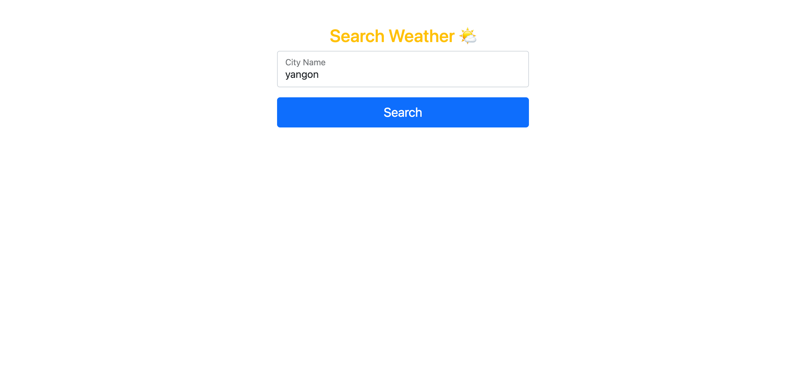
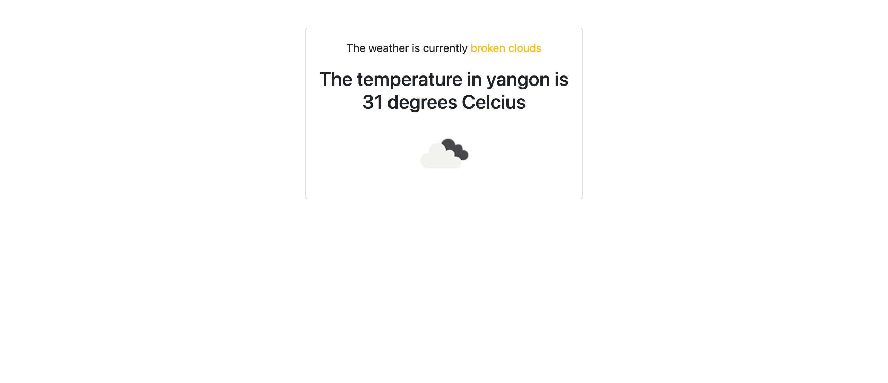

# PHP weather App

-  

 In this project,
 -you will learn how to read api from other server such as [openweathermap](https://openweathermap.org)

 -how to fetch params *request* using **super global variable** .
 
 -how to *decode* ***JSON*** fetched from api.